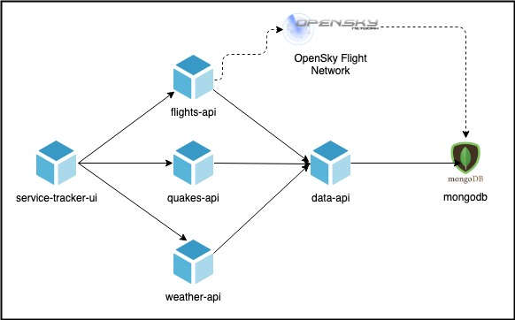

## Service Tracker Example

This is an example microservices application with a Javascript Web UI, a MongoDB database, and a series of API microservices. The idea is that various app developers would create Components for their corresponding apps. The overall config will add traits and allow the app to be fully deployed. 
The application being deployed is shown in the following diagram: 



> Full application original source here: https://github.com/chzbrgr71/service-tracker 

In this example, there are various roles that handle each aspect of the OAM application.

* UI Developer
* API Microservices Developer
* MongoDB Admin
* App Operator / SRE (handles applicaiton deployment in Kubernetes)

### Deploying to Kubernetes

The Kubernetes cluster must have the Operator deployed. This can be found here: https://github.com/oam-dev/rudr 

1. Once rudr is installed in the cluster, first add the `ComponentSchematics`

    ```
    kubectl apply -f tracker-db-component.yaml
    kubectl apply -f tracker-data-component.yaml
    kubectl apply -f tracker-flights-component.yaml
    kubectl apply -f tracker-quakes-component.yaml
    kubectl apply -f tracker-weather-component.yaml
    kubectl apply -f tracker-ui-component.yaml
    ```

2. Then install the `AppConfiguration`

    ```
    kubectl create -f tracker-app-config.yaml
    ```

### Continuous Integration with GitHub Actions

Continuous Integration (CI) automation for an OAM application is similar to other Kubernetes CI automation.  The typical process builds a Docker image for each application component, pushes the image to a repository, updates each component configuration to reference the newly pushed image, and applies the updated configuration to the Kubernetes cluster.

This repo includes an example of CI automation using GitHub workflows and actions. The repo includes a custom GitHub Action, `yamlpackage` used by the workflow to perform the update of the Docker image reference for each application component.

The workflow runs automatically on each push to this GitHub repo (or fork of this repo).  However, the workflow will not be successful until it has been configured for a specific Docker repository and Kubernetes cluster.

#### Cloud Setup

The workflow expects both a private Docker repository (e.g. ACR) to push images to as well as an AKS cluster to deploy the components to.

#### Component Setup

The workflow assumes images will be pushed to a private Docker repository; the workflow creates the Kubernetes secret (named `rudrimagepullsecret`) used to authenticate against the repository but the component schematics must be updated to use that pull secret (as, by default, the sample pulls images from a public repository).

Add the `imagePullSecret` property to each of the `data`/`flights`/`quakes`/`weather`/`ui` component YAML files:

  ```yaml
    containers:
    - name: <existing name>
      image: <existing image>
      imagePullSecret: rudrimagepullsecret
  ```

#### Secrets Setup

The workflow expects several secrets to be set within this repo (or fork of this repo):

  | Secret | Description |
  |--------|-------------|
  | ACR_REGISTRY_NAME | The hostname of the Docker registry |
  | ACR_REGISTRY_USERID | The user ID for authenticating with the Docker registry |
  | ACR_REGISTRY_PASSWORD | The password for authenticating with the Docker registry |
  | AZURE_CREDENTIALS | The credentials used to authenticate with the AKS cluster (see the [aks-set-context](https://github.com/Azure/k8s-actions/tree/master/aks-set-context#azure-credentials) GitHub action guide for details) |
  | AKS_CLUSTER_NAME | The name of the AKS cluster |
  | AKS_CLUSTER_RESOURCE_GROUP | The resource group in which the AKS cluster resides |